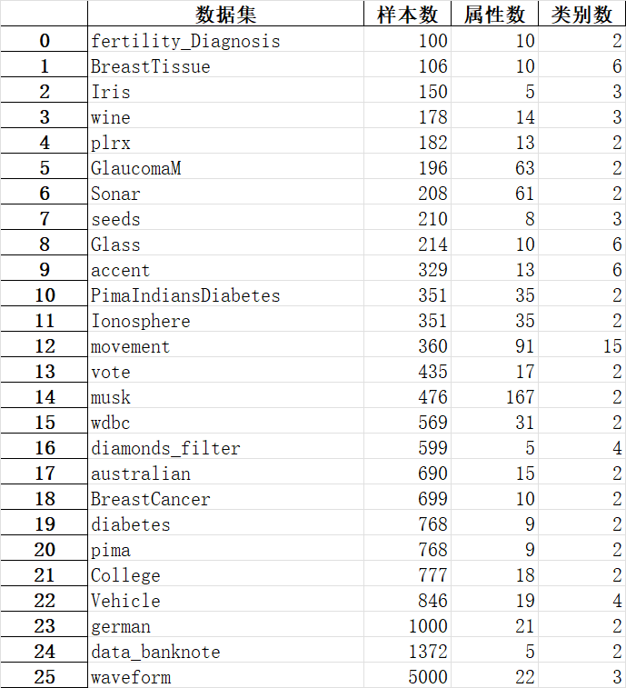

目录结构:
- exp1
    - myAlgorithm
      - dataName1.csv
      - dataName2.csv
      - dataName2.csv
    - compareAlgorithms
      - compareAlgorithm1
        - dataName1.csv
        - dataName2.csv
        - dataName3.csv
        - ...
      - compareAlgorithm2
        - dataName1.csv
        - dataName2.csv
        - dataName3.csv
        - ...
      - compareAlgorithm3
        - dataName1.csv
        - dataName2.csv
        - dataName3.csv
        - ...
      - compareAlgorithm4
        - dataName1.csv
        - dataName2.csv
        - dataName3.csv
        - ...
      - compareAlgorithm5
        - dataName1.csv
        - dataName2.csv
        - dataName3.csv
        - ...

针对对比算法结果需要记录必须的内容  
结果生成时间, 算法名称, 数据集名称, 约简结果, 依赖度, 约简时间  
实验半径: 0.02, 0.04, ..., 0.40  
实验用到的数据集及其顺序:  
